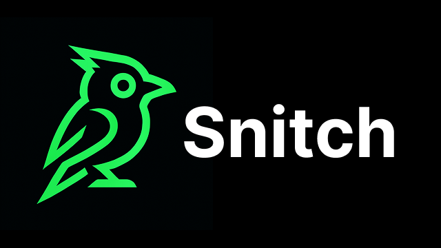

# Snitch — AI-Powered On-Chain Smart Contract Audit Registry

Welcome to **Snitch**, a next-gen platform that automatically audits your smart contracts and stores immutable audit scores on-chain — bringing trustless, transparent, and instant security verification to Web3.

---

## 🚀 What is Snitch?

Snitch connects directly to your GitHub repository and runs a powerful AI-driven audit agent that analyzes your smart contracts in real-time. It checks for critical vulnerabilities, gas and storage optimization, logical flaws, and access control issues. Instead of slow, manual audits delivered as PDFs, Snitch generates concise audit scores and stores them immutably on the Flow blockchain.

This creates a public, tamper-proof registry of audit scores anyone can verify, helping developers, users, and protocols confidently assess contract security without blind trust.

---

## 🧩 Key Features

* **Automated AI audits** triggered on GitHub push events
* **Multi-faceted analysis** covering security, performance, and logic
* **Immutable on-chain audit scores** stored on Flow blockchain
* **Fast, real-time feedback** via a slick web UI
* **Cryptographic anchoring** of audit reports to commits
* **Off-chain detailed report storage** with IPFS integration
* **Developer-friendly architecture** ready to expand to other smart contract languages

---

## 🛠️ Architecture Overview

### 1. GitHub Integration

* Users connect their GitHub repo via OAuth.
* Snitch listens to webhook push events.
* On each commit, the AI audit agent runs automatically.

### 2. AI Audit Agent

* Detects vulnerabilities: reentrancy, access control lapses, gas/storage inefficiencies, logical bugs.
* Produces an audit report with severity, detailed issue descriptions, and fix suggestions.

### 3. On-Chain Registry on Flow

* Audit scores and essential metadata are stored immutably on Flow blockchain smart contracts.
* Detailed audit reports are stored off-chain on IPFS with their hashes linked on-chain.
* Ensures trustlessness, transparency, and tamper resistance.

### 4. Frontend

* Built with Next.js for fast SSR and a smooth user experience.

---

## 📈 How It Works

1. **Connect your GitHub repo** to Snitch.
2. Select the smart contract to analyze/audit.
3. Snitch’s AI audit agent will automatically analyze this contract based on several aspects.
4. Audit findings and scores are generated instantly.
5. Audit scores are stored on the Flow blockchain in the central registry.
6. Users and protocols can query the registry to verify contract security trustlessly.

---

## 🎯 Why Snitch?

* **Speed:** Automated audits run immediately on new code pushes.
* **Trust:** Audit scores are stored on-chain, eliminating reliance on centralized auditors.
* **Transparency:** Immutable audit data publicly verifiable by anyone.
* **Actionable:** Detailed reports help developers fix issues fast.
* **Scalable:** Designed for multi-chain ecosystems with potential to expand beyond Flow.

---

**Snitch** — Because your smart contracts deserve a loudmouth watchdog.
